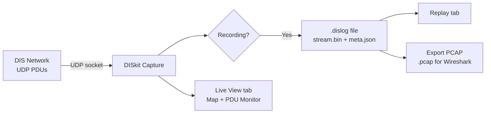

# Log Mode (Capture)

The **Log** tab controls DIS traffic capture. DISkit listens on a UDP socket and can record the raw PDU stream to a `.dislog` file for later replay and analysis.

---

## Capture Setup

### Network Settings

| Control | Description |
|---|---|
| **Port** | UDP port to listen on (default `3000`). Must match the port used by the simulation network. |
| **Multicast** | Enable to join a multicast group. When enabled, the **Group** field becomes active. |
| **Group** | Multicast group address (default `239.1.2.3`). Only used when Multicast is enabled. |
| **Bind Address** | Network interface to bind. Defaults to `0.0.0.0` (all interfaces). Select a specific adapter from the dropdown when the host has multiple NICs. |

### Starting and Stopping Capture

1. Configure the network settings above.
2. Click **Start Listening** — DISkit opens the UDP socket and begins receiving PDUs. The statistics bar in the View tab starts updating.
3. Click **Stop Listening** to close the socket.

---

## Recording

### Recording Controls

Once listening is active, use the recording controls to capture traffic to a file.

| Control | Description |
|---|---|
| **● Record** | Start recording to a `.dislog` file |
| **■ Stop** | Stop the current recording |
| **Save location** | Folder on the host machine where `.dislog` files are saved. Click **Browse** (on the host machine) to pick a folder via the OS dialog. |
| **File** | Optional custom filename. If left blank, DISkit auto-generates a timestamp-based name. |

### PDU Filtering (Recording)

Recordings can be filtered to capture only specific PDU types or DIS versions:

| Filter | Description |
|---|---|
| **PDU types** | Multi-select list of PDU type numbers (1=Entity State, 2=Fire, 3=Detonation, etc.). Leave blank to record all types. |
| **DIS versions** | Filter by DIS protocol version (v4, v5, v6, v7). Leave blank to record all versions. |
| **Site IDs** | Comma-separated list of Site IDs to record (blank = all sites). |
| **App IDs** | Comma-separated list of Application IDs to record (blank = all applications). |

> **Tip**: Filtering reduces file size significantly on busy networks. Entity State PDUs alone (type 1) can dominate traffic — consider excluding them if you only need fire/detonation logs.

---

## Bookmarks

Bookmarks mark specific moments within a recording for easy navigation during replay.

1. Ensure recording is active.
2. Type a label in the **Bookmark** field.
3. Click **+ Mark** to insert a bookmark at the current capture time.

Bookmarks are stored in the `.dislog` metadata and appear as visual tick marks on the replay timeline. Clicking a bookmark during replay seeks directly to that timestamp.

---

## Log File Management

The **Recordings** section lists all `.dislog` files found in the configured log directory.

| Column | Description |
|---|---|
| **Name** | Log file name |
| **Duration** | Recorded duration |
| **PDUs** | Total PDU count |
| **Size** | File size |

### Operations

- **Load** → Switches to the Replay tab with the selected log loaded.
- **Export PCAP** → Converts the `.dislog` to a standard `.pcap` file for analysis in Wireshark or similar tools.
- **Delete** → Permanently removes the log file.

### Host Log Folder

The **Host Log Folder** field (in the recordings section header) allows changing the active log directory from within the browser UI. This is particularly useful when accessing DISkit remotely — the folder selector opens a dialog on the **host machine** (where DISkit is running), not the client browser.

---

## .dislog File Format

DISkit's `.dislog` files are standard ZIP archives containing:

| File | Description |
|---|---|
| `stream.bin` | Binary PDU stream: `[uint64 offset µs][uint16 source port][uint16 length][raw PDU bytes]` |
| `meta.json` | Capture metadata: start time, duration, PDU type counts, DIS version counts, bookmarks |

Because the format is a ZIP, log files can be opened and inspected with any ZIP utility. The binary stream is suitable for direct import into other DIS analysis tools.

---

## Workflow Diagram

