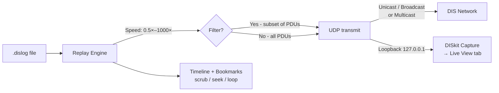

# Replay Mode

The **Replay** tab loads `.dislog` files and re-transmits the recorded PDU stream onto the network. All display features in the View tab work during replay, making it easy to analyse captured exercises offline.

> 📸 *Screenshot: Replay tab with a log file loaded, timeline visible, and playback active.*

---

## Loading a Log File

1. Use the **Host Log Folder** field and **Browse** button to point DISkit at the folder containing your `.dislog` files.
2. Select a log file from the **Log File** dropdown.
3. The timeline bar appears, showing the recording duration and any bookmarks as tick marks.

Alternatively, load a file directly from the Log tab by clicking **Load** on a recording in the list.

---

## Replay Controls

| Control | Description |
|---|---|
| **▶ Play** | Start replay from the current position |
| **⏸ Pause** | Pause at the current position |
| **⏹ Stop** | Stop and reset to the beginning |
| **Timeline** | Click anywhere on the timeline to seek to that position. Drag to scrub. |
| **Bookmarks** | Bookmark tick marks on the timeline are clickable — click to jump directly to that moment. |

### Speed

The **Speed** slider controls replay rate relative to real time:

| Speed | Behaviour |
|---|---|
| `0.5×` | Half speed — useful for slow-motion analysis |
| `1×` | Real time |
| `2×` – `10×` | Accelerated — useful for fast-forwarding long captures |
| `100×` – `1000×` | Maximum speed — plays back as fast as the network can accept |

### Loop

Enable **Loop** to continuously replay the log from the beginning after it finishes. Useful for sustained testing of downstream systems.

---

## Replay Destination

| Control | Description |
|---|---|
| **Broadcast Address** | IP address to send replayed PDUs to. Auto-calculated from the local subnet broadcast if left blank (e.g. `192.168.1.255`). Use `127.0.0.1` for loopback testing. |
| **Port** | Destination UDP port (default `3000`). |
| **Multicast** | Send replayed PDUs to the configured multicast group instead of unicast/broadcast. |
| **Group** | Multicast group address (active only when Multicast is enabled). |

> **Loopback testing**: Set destination to `127.0.0.1` with port `3000` to replay traffic back into DISkit's own capture socket — the View tab will show entities and events as if live.

---

## DIS Version Translation

Replay logs can be re-transmitted as a different DIS protocol version to interoperate with simulators that require a specific version:

| Version | Standard |
|---|---|
| **v4** | IEEE 1278.1-1993 |
| **v5** | IEEE 1278.1a-1998 |
| **v6** | IEEE 1278.1a-1998 (rev) |
| **v7** | IEEE 1278.1-2012 (default) |

Version translation rewrites the protocol version field in the PDU header. Field-level compatibility between versions is maintained where possible.

---

## PDU Filtering (Replay)

Replay can be filtered to only retransmit a subset of the recorded PDUs:

| Filter | Description |
|---|---|
| **PDU types** | Retransmit only these PDU type numbers |
| **DIS versions** | Retransmit only PDUs of these protocol versions |
| **Site IDs** | Filter by source Site ID |
| **App IDs** | Filter by source Application ID |

This allows, for example, replaying only Entity State PDUs (type 1) to a map display while suppressing radio traffic.

---

## Bookmarks During Replay

Bookmarks captured during recording appear as vertical tick marks on the replay timeline. You can also add new bookmarks during replay:

1. Type a label in the **Bookmark label** field.
2. Click **🔖 Mark** at the desired playback position.

New bookmarks are saved back to the `.dislog` file metadata immediately.

---

## Workflow Diagram

